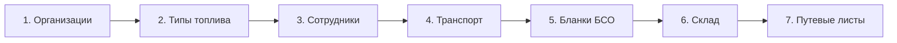
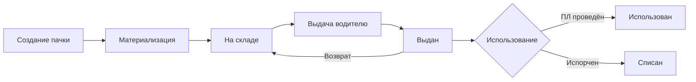

# Руководство пользователя
# Система управления путевыми листами

---

## Содержание

1. [Введение](#введение)
2. [Начало работы](#начало-работы)
3. [Этап 1: Заполнение справочников](#этап-1-заполнение-справочников)
4. [Этап 2: Управление бланками БСО](#этап-2-управление-бланками-бсо)
5. [Этап 3: Склад и топливные карты](#этап-3-склад-и-топливные-карты)
6. [Этап 4: Работа с путевыми листами](#этап-4-работа-с-путевыми-листами)
7. [Этап 5: Отчётность и экспорт](#этап-5-отчётность-и-экспорт)
8. [Справочник статусов](#справочник-статусов)
9. [Настройки системы](#настройки-системы)
10. [Часто задаваемые вопросы](#часто-задаваемые-вопросы)

---

## Введение

Система «Путевые листы» предназначена для автоматизации учёта путевых листов, управления автопарком, контроля расхода топлива и ведения документооборота в автотранспортных предприятиях.

### Основные возможности

- Учёт путевых листов с автоматическим расчётом расхода топлива
- Управление справочниками: организации, сотрудники, транспортные средства
- Учёт бланков строгой отчётности (БСО)
- Складской учёт топлива и материалов
- Управление топливными картами водителей
- Формирование отчётов и экспорт данных
- Гибкая система ролей и прав доступа

### Режимы работы

Система поддерживает два режима работы, которые выбираются в разделе **Настройки**:

| Режим | Описание | Кому подходит |
|-------|----------|---------------|
| **Driver Mode (Упрощённый)** | Водитель самостоятельно создаёт и проводит путевые листы. Цепочка статусов: Черновик → Проведён | Малые организации, ИП, 1–5 автомобилей |
| **Central Mode (С проверкой)** | Водитель создаёт документ, диспетчер проверяет и проводит. Цепочка: Черновик → Отправлен → Проведён | Автопарки с диспетчером, строгий контроль |

> 💡 **Совет:** Для небольших организаций рекомендуется режим **Driver Mode** — он упрощает работу и сокращает количество шагов.

---

## Начало работы

### Рекомендуемый порядок настройки

Перед началом работы с путевыми листами необходимо заполнить базовые справочники в следующем порядке:



> ❗ **Важно:** Нарушение порядка может привести к ошибкам. Например, нельзя создать сотрудника без указания организации, к которой он относится.

---

## Этап 1: Заполнение справочников

Справочники — это базовые данные, на которых строится вся работа системы. Переход к справочникам: **Главное меню → Справочники**.

### 1.1. Организации

Организации — это юридические лица и подразделения, участвующие в документообороте. Сюда вносятся:
- Ваша компания (головная организация)
- Филиалы и подразделения
- Медицинские учреждения (для печати в путевых листах)
- Контрагенты и поставщики топлива

#### Создание организации

1. Перейдите в раздел **Справочники → Организации**
2. Нажмите кнопку **«+ Добавить организацию»**
3. Заполните обязательные поля:
   - **Краткое наименование** — отображается в списках и отчётах
   - **ИНН** — 10 или 12 цифр (валидируется автоматически)
   - **ОГРН** — 13 или 15 цифр (валидируется автоматически)
4. При необходимости заполните дополнительные поля

#### Ключевые настройки организации

| Поле | Описание |
|------|----------|
| **Галочка «Своя организация»** | Отметьте для вашей основной компании. Используется для автоподстановки в путевых листах |
| **Головная организация** | Для филиалов — укажите родительскую организацию. Реквизиты (ИНН, КПП) можно унаследовать |
| **Группа «Мед. учреждение»** | Выберите для медицинских организаций — откроются поля для ввода лицензии |
| **Номер мед. лицензии** | Требуется для корректной печати путевых листов |

#### Банковские реквизиты

Для организаций можно указать банковские реквизиты:
- **Расчётный счёт** — 20 цифр
- **Корреспондентский счёт** — 20 цифр
- **БИК банка** — 9 цифр (валидируется)
- **Наименование банка**

> 📝 **Примечание:** Банковские реквизиты не являются обязательными для работы с путевыми листами, но могут использоваться в печатных формах.

---

### 1.2. Типы топлива

Перед созданием транспортных средств необходимо настроить справочник типов топлива.

#### Переход к справочнику

**Настройки → Типы топлива**

#### Стандартные типы топлива

Система предлагает создать следующие типы:

| Код | Наименование | Плотность (кг/л) |
|-----|--------------|------------------|
| AI-92 | Бензин АИ-92 | 0.735 |
| AI-95 | Бензин АИ-95 | 0.750 |
| AI-98 | Бензин АИ-98 | 0.765 |
| DT | Дизельное топливо | 0.840 |
| GAS | Газ (пропан-бутан) | 0.530 |
| METHANE | Метан | — |

#### Создание типа топлива

1. Нажмите **«+ Добавить тип топлива»**
2. Укажите:
   - **Код** — уникальный идентификатор (например, AI-92)
   - **Наименование** — полное название
   - **Плотность** (опционально) — для пересчёта литров в килограммы

---

### 1.3. Сотрудники

В справочнике сотрудников хранится информация о водителях, диспетчерах, механиках и других работниках.

#### Переход к справочнику

**Справочники → Сотрудники**

#### Типы сотрудников

| Тип | Описание | Особенности |
|-----|----------|-------------|
| **Водитель** | Управляет транспортными средствами | Дополнительные вкладки: ВУ, медсправка, топливная карта |
| **Диспетчер** | Проверяет и проводит путевые листы | Отображается в списке при назначении в ПЛ |
| **Механик** | Контролирует техническое состояние | Может быть назначен контролёром ПЛ |
| **Контролёр** | Выполняет предрейсовый осмотр | Отмечается в путевом листе |
| **Бухгалтер** | Работает с отчётами и проведением | Доступ к финансовой информации |
| **Менеджер** | Управляет подразделением | Расширенные права |
| **Другое** | Прочие сотрудники | Базовый функционал |

#### Создание водителя

1. Нажмите **«+ Добавить сотрудника»**
2. Заполните обязательные поля:
   - **ФИО** — полное имя сотрудника
   - **Тип сотрудника** — выберите «Водитель»
3. Система автоматически сформирует **Краткое имя** (Фамилия И.О.)

#### Данные водителя

После выбора типа «Водитель» открываются дополнительные вкладки:

**Вкладка «Водительское удостоверение»:**
- Номер документа
- Дата окончания действия
- Категории (A, B, C, D, E и подкатегории)

**Вкладка «Медицинская справка»:**
- Серия и номер
- Дата выдачи
- Дата окончания действия
- Медицинское учреждение (выбор из справочника организаций)

**Вкладка «Топливная карта»:**
- Номер топливной карты
- Текущий баланс (рассчитывается автоматически)

#### Закрепление диспетчера и механика

В карточке водителя можно указать:
- **Закреплённый диспетчер** — будет автоматически подставляться в путевые листы
- **Закреплённый контролёр** — механик для предрейсового осмотра

> 💡 **Совет:** Закрепление диспетчера и контролёра за водителем экономит время при создании путевых листов — поля заполняются автоматически.

---

### 1.4. Транспортные средства

Справочник транспортных средств содержит данные об автомобилях и их нормах расхода топлива.

#### Переход к справочнику

**Справочники → Транспортные средства**

#### Создание транспортного средства

1. Нажмите **«+ Добавить ТС»**
2. Заполните обязательные поля:
   - **Государственный номер** — регистрационный знак
   - **Марка** — марка и модель автомобиля
   - **Тип топлива** — выберите из справочника

#### Нормы расхода топлива

Для каждого автомобиля задаются нормы расхода (л/100 км):

| Параметр | Описание |
|----------|----------|
| **Летняя норма** | Базовый расход в тёплое время года |
| **Зимняя норма** | Расход в холодное время года (обычно на 10-15% выше) |
| **Надбавка «Город»** | Процент увеличения расхода в городском цикле |
| **Надбавка «Прогрев»** | Процент для учёта прогрева двигателя |

**Пример расчёта:**
```
Летняя норма: 10 л/100 км
Надбавка «Город»: 10%
Маршрут 50 км (город)

Расход = (50 / 100) × 10 × (1 + 0.10) = 5.5 л
```

#### Дополнительные параметры

| Параметр | Назначение |
|----------|------------|
| **Закреплённый водитель** | Автоматически выбирается при создании ПЛ |
| **Объём топливного бака** | Для контроля переполнения |
| **Текущий пробег** | Синхронизируется с путевыми листами |
| **Текущий остаток топлива** | Обновляется при проведении ПЛ |

#### Документы транспортного средства

Для каждого ТС можно внести:
- **ОСАГО** — серия, номер, даты действия
- **Диагностическая карта** — номер, дата выдачи, срок действия
- **Интервал ТО** — пробег между техническими обслуживаниями
- **Последний пробег при ТО** — для расчёта приближающегося обслуживания

> ⚠️ **Внимание:** Система контролирует сроки окончания документов и интервалы ТО. Просроченные документы отображаются на панели управления.

---

### 1.5. Сохранённые маршруты

Система позволяет сохранять часто используемые маршруты для быстрого добавления в путевые листы.

#### Переход к маршрутам

**Справочники → Маршруты**

#### Автоматическое сохранение

При создании путевого листа все новые маршруты автоматически сохраняются в справочник. При следующем вводе система предложит автозаполнение расстояния.

#### Ручное создание маршрута

1. Нажмите **«+ Добавить маршрут»**
2. Укажите:
   - **Откуда** — точка отправления
   - **Куда** — точка назначения
   - **Расстояние (км)** — длина маршрута

---

## Этап 2: Управление бланками БСО

Бланки строгой отчётности (БСО) — это учётные номера путевых листов. Система ведёт их строгий учёт: от поступления до использования.

> ❗ **Важно:** Если вы НЕ используете бумажные бланки, этот раздел можно пропустить. Путевые листы будут иметь автоматическую нумерацию.

#### Переход к управлению бланками

**Настройки → Бланки ПЛ** или **Бланки ПЛ** (в меню для режима «Водитель»)

### Жизненный цикл бланка



### Шаг 1: Создание пачки бланков

1. Перейдите на вкладку **«Пачки»**
2. Нажмите **«+ Создать пачку»**
3. Заполните:
   - **Организация** — для какой организации бланки
   - **Серия** — буквенная серия (например, «ПЛ» или «АА»)
   - **Начальный номер** — первый номер в диапазоне
   - **Конечный номер** — последний номер в диапазоне
   - **Примечание** (опционально) — комментарий

**Пример:** Серия «АА», номера 0001–0100 создаст 100 бланков.

### Шаг 2: Материализация бланков

После создания пачки необходимо её «материализовать» — создать индивидуальные записи для каждого номера.

1. В списке пачек найдите нужную
2. Нажмите кнопку **«Материализовать»**
3. Подтвердите операцию

После материализации бланки получают статус **«На складе»** и готовы к выдаче.

### Шаг 3: Выдача бланков водителю

Бланки выдаются водителям для использования в путевых листах.

1. Выберите пачку и нажмите **«Выдать»**
2. Выберите водителя из списка
3. Укажите количество бланков для выдачи
4. Подтвердите выдачу

Бланки переходят в статус **«Выдан»** и закрепляются за водителем.

### Шаг 4: Использование бланка

При создании путевого листа:
1. Выберите водителя — система автоматически находит первый свободный бланк
2. Бланк резервируется за черновиком
3. При проведении ПЛ бланк переходит в статус **«Использован»**

### Списание испорченных бланков

Если бланк испорчен (повреждён, потерян, ошибка печати):

1. Перейдите на вкладку **«Бланки»**
2. Найдите нужный бланк
3. Нажмите **«Списать»**
4. Выберите причину списания:
   - Повреждён
   - Брак печати
   - Утерян
   - Другое
5. При необходимости добавьте комментарий

> 🚨 **Осторожно:** Списанные бланки нельзя восстановить. Они сохраняются в истории для аудита.

---

## Этап 3: Склад и топливные карты

### Номенклатура

Номенклатура — это справочник товаров, материалов и топлива, хранящихся на складе.

#### Переход к номенклатуре

**Главное меню → Номенклатура и Склад**

#### Создание позиции номенклатуры

1. На вкладке **«Номенклатура»** нажмите **«+ Добавить»**
2. Заполните:
   - **Наименование** — название позиции
   - **Код** — уникальный код (артикул)
   - **Единица измерения** — литры, штуки, кг и т.д.
   - **Группа** — категория (Топливо, Запчасти, Расходники)
3. Для топлива отметьте галочку **«Это топливо»** и выберите тип топлива

#### Виды номенклатуры

| Группа | Примеры | Особенности |
|--------|---------|-------------|
| **Топливо** | Бензин АИ-92, ДТ | Учёт на топливных картах |
| **Материалы** | Масла, антифриз | Списание на ТС |
| **Запчасти** | Фильтры, колодки | Учёт серийных номеров |
| **Шины** | Резина R16, R17 | Учёт пробега |

### Складские операции

Все движения номенклатуры оформляются документами: **Поступление** и **Списание**.

#### Вкладка «Транзакции»

Здесь отображаются все складские документы с возможностью фильтрации по:
- Периоду (дата от/до)
- Типу операции (приход/расход)
- Организации
- Транспортному средству

#### Создание документа «Поступление»

1. Нажмите **«+ Приход»**
2. Заполните шапку:
   - **Дата** — дата поступления
   - **Организация** — куда поступает товар
   - **Поставщик** (опционально)
3. Добавьте строки:
   - Выберите позицию номенклатуры
   - Укажите количество
   - При необходимости — цену за единицу
4. Нажмите **«Сохранить»**

#### Создание документа «Списание»

1. Нажмите **«+ Расход»**
2. Заполните шапку:
   - **Дата** — дата списания
   - **Организация** — откуда списывается
   - **Транспорт** — на какое ТС списывается (обязательно для некоторых типов)
   - **Водитель** — кто получает
   - **Причина списания**
3. Добавьте строки товара
4. Сохраните

#### Причины списания

| Причина | Описание |
|---------|----------|
| **Путевой лист** | Списание топлива по ПЛ |
| **Техническое обслуживание** | Запчасти и материалы для ТО |
| **Списание** | Естественная убыль, порча |
| **Пополнение топливной карты** | Начисление на карту водителя |
| **Инвентаризация** | Корректировка по результатам инвентаризации |

### Топливные карты

Топливная карта — это виртуальный счёт водителя, с которого списывается топливо при проведении путевых листов.

#### Как работает топливная карта

1. **Пополнение:** Создаётся документ списания со склада с причиной «Пополнение топливной карты»
2. **Расход:** При проведении ПЛ поле «Заправлено» списывается с баланса карты
3. **Баланс:** Рассчитывается как сумма пополнений минус сумма расходов (из проведённых ПЛ)

#### Пополнение топливной карты

1. На вкладке **«Транзакции»** нажмите **«+ Пополнить карту»**
2. Выберите водителя
3. Выберите тип топлива (номенклатуру)
4. Укажите количество литров
5. При необходимости отметьте **«Выполнить сразу»** — создаст документ и проведёт его

#### Автопополнение карт

Система поддерживает автоматическое пополнение по расписанию.

**Настройка на вкладке «Автопополнение»:**

1. Нажмите **«+ Создать правило»**
2. Выберите водителя
3. Выберите номенклатуру (топливо)
4. Укажите количество
5. Выберите периодичность:
   - **Ежемесячно** — 1-го числа каждого месяца
   - **Ежеквартально** — 1-го числа каждого квартала
6. Активируйте правило

> 📝 **Примечание:** Автопополнение выполняется автоматически при запуске приложения. Если на складе недостаточно топлива, система выдаст предупреждение.

### Учёт шин

Система ведёт учёт шин с контролем пробега и износа.

#### Вкладка «Шины»

**Параметры шины:**
- Марка, модель, размер
- Сезонность (Летняя / Зимняя / Всесезонная)
- Дата покупки и цена
- Начальная глубина протектора
- Текущая глубина протектора
- Расчётный ресурс (км)

#### Методы начисления пробега на шины

В настройках системы можно выбрать метод:

| Метод | Описание |
|-------|----------|
| **По факту установки** | Пробег начисляется на все установленные шины независимо от сезона |
| **Строго по сезону** | Летом пробег идёт только на летние/всесезонные шины, зимой — на зимние/всесезонные |

---

## Этап 4: Работа с путевыми листами

Путевой лист (ПЛ) — основной документ системы, фиксирующий поездки, пробег и расход топлива.

### Переход к путевым листам

**Главное меню → Путевые листы**

### Список путевых листов

На странице отображается таблица всех путевых листов с возможностью:
- Фильтрации по периоду, статусу, ТС, водителю
- Сортировки по любому столбцу
- Массовых операций (проведение, удаление нескольких ПЛ)
- Экспорта в Excel

#### Столбцы таблицы

| Столбец | Описание |
|---------|----------|
| **Номер** | Номер бланка (серия+номер) или автономер |
| **Дата** | Дата документа |
| **Статус** | Текущий статус ПЛ |
| **ТС** | Государственный номер и марка |
| **Водитель** | ФИО водителя |
| **Организация** | Организация |
| **Выезд / Возврат** | Даты и время |
| **Пробег** | Начальный - Конечный (Разница) |
| **Топливо** | Заправлено / Расход |

### Создание путевого листа

#### Шаг 1: Открытие формы

Нажмите кнопку **«+ Создать ПЛ»** над списком.

#### Шаг 2: Заполнение основных данных

**Вкладка «Основные»:**

1. **Транспортное средство** — выберите из списка
   - При выборе автоматически подставляются:
     - Закреплённый водитель
     - Начальный пробег (из последнего проведённого ПЛ или карточки ТС)
     - Начальный остаток топлива
     - Следующий доступный бланк

2. **Водитель** — можно изменить вручную
   - При смене водителя обновляются диспетчер, контролёр и бланки

3. **Организация** — выбирается автоматически или вручную

4. **Диспетчер** — выбирается из закреплённого или из списка

5. **Контролёр** — механик для предрейсового осмотра

6. **Режим «Один день / Многодневный»:**
   - **Один день** — время выезда и возврата в один день
   - **Многодневный** — командировка на несколько дней

7. **Даты и время:**
   - Дата и время выезда
   - Дата и время возврата

#### Шаг 3: Заполнение маршрутов

**Вкладка «Маршруты»:**

1. Нажмите **«+ Добавить маршрут»**
2. Заполните:
   - **Откуда** — начальная точка (автозаполнение из сохранённых)
   - **Куда** — конечная точка
   - **Расстояние** — автоматически из справочника или вручную
   - **Дата** — для многодневных ПЛ
   - **Время отправления / прибытия** (опционально)
3. Установите флаги при необходимости:
   - **Городской цикл** — применяет надбавку
   - **Прогрев** — применяет надбавку за прогрев

При добавлении маршрутов автоматически пересчитывается:
- Конечный пробег
- Расход топлива по норме
- Остаток топлива на конец

> 💡 **Совет:** При совпадении маршрута (Откуда + Куда) с сохранённым расстояние подставляется автоматически.

#### Генерация маршрутов с помощью ИИ

Если настроен Gemini API, можно генерировать маршруты из текстового описания:

1. Введите описание в поле: *«Москва - Тула и обратно»*
2. Нажмите **«Сгенерировать»**
3. Система создаст маршруты с примерными расстояниями

#### Шаг 4: Данные о топливе

**Вкладка «Топливо»:**

1. **Начальный остаток** — подставляется автоматически
2. **Заправлено** — введите количество заправленного топлива
   - Можно выбрать из складских операций (кнопка «Выбрать из склада»)
   - При выборе документ склада привязывается к ПЛ
3. **Расход по норме** — рассчитывается автоматически
4. **Конечный остаток** — рассчитывается по формуле:

```
Конечный = Начальный + Заправлено - Расход
```

### Методы расчёта расхода топлива

В форме ПЛ доступен выбор метода расчёта:

| Метод | Описание | Формула |
|-------|----------|---------|
| **По отрезкам (Точный)** | Каждый маршрут рассчитывается отдельно с его коэффициентами, результаты суммируются | Σ (Пробег × Норма × Коэффициенты) |
| **По общему (Смешанный)** | Рассчитывается средний расход на основе маршрутов, применяется к общему пробегу | Общий_Пробег × Средний_Расход |
| **Котловой (Базовый)** | Общий пробег умножается на базовую норму без учёта надбавок | Общий_Пробег × Базовая_Норма |

**Коэффициенты надбавок:**
- **Зима** — применяется зимняя норма вместо летней (или надбавка в %)
- **Город** — процент увеличения расхода в городском цикле
- **Прогрев** — фиксированная надбавка за прогрев двигателя

> ❗ **Важно:** При ручном изменении поля «Расход по норме» автоматический пересчёт отключается до сохранения.

### Сохранение и проведение

#### Сохранение черновика

Нажмите **«Сохранить»** для сохранения без проведения. Документ остаётся в статусе «Черновик» и доступен для редактирования.

#### Проведение путевого листа

**В режиме Driver Mode:**
Нажмите **«Провести»** — документ сразу получает статус «Проведён».

**В режиме Central Mode:**
1. Водитель нажимает **«Отправить на проверку»** — статус «Отправлен»
2. Диспетчер открывает документ и нажимает **«Провести»**

#### Что происходит при проведении

1. **Списание топлива** с топливной карты водителя (поле «Заправлено»)
2. **Обновление пробега** транспортного средства
3. **Обновление остатка топлива** в карточке ТС
4. **Начисление пробега на шины** (если установлены и активен учёт)
5. **Использование бланка** — переход в статус «Использован»
6. **Создание записи аудита**

### Проверка данных путевых листов

Перед проведением рекомендуется провести проверку данных.

**Кнопка «Проверить»** (иконка галочки в списке) запускает анализ:

- **Разрывы пробега** — несовпадение конечного и начального одометра между ПЛ
- **Отрицательные остатки топлива** — расчётный конец меньше нуля
- **Превышение объёма бака** — остаток больше ёмкости бака
- **Перерасход топлива** — фактический расход значительно выше нормы
- **Просроченные маршруты** — даты маршрутов вне диапазона ПЛ

### Пересчёт цепочки (Chain Recalc)

Если вы удалили или изменили старый путевой лист, последующие черновики могут содержать некорректные данные.

**Функция «Пересчёт цепочки»:**

1. Находит последний проведённый ПЛ для выбранного ТС
2. Берёт его конечные показания (пробег, топливо)
3. Последовательно обновляет все черновики:
   - Начальный пробег = Конечный предыдущего
   - Начальный остаток = Конечный предыдущего
   - Пересчитывает расход и конечные значения

**Запуск:** кнопка «Пересчитать цепочку» над списком ПЛ.

### Корректировка проведённого ПЛ

Проведённый документ нельзя редактировать напрямую. Для внесения изменений:

1. Откройте проведённый ПЛ
2. Нажмите **«Корректировка»**
3. Введите причину корректировки
4. Документ вернётся в статус «Черновик»
5. Внесите изменения и проведите повторно

> ⚠️ **Внимание:** Корректировка отменяет все эффекты проведения: возвращает топливо на карту, откатывает пробег и т.д.

### Массовые операции

В списке путевых листов можно выбрать несколько документов (чекбоксами) и выполнить:

- **Провести выбранные** — массовое проведение черновиков
- **Отменить выбранные** — массовая отмена
- **Удалить выбранные** — удаление (с возможностью списать бланки)
- **Экспорт в Excel** — выгрузка выбранных ПЛ

### Генератор пачек путевых листов

Для автоматического создания множества путевых листов используйте **Генератор пачек**.

**Кнопка «Генератор»** открывает модальное окно:

1. Выберите транспортное средство
2. Укажите период (дата от / до)
3. Добавьте шаблоны маршрутов
4. Нажмите **«Сгенерировать»**

Система создаст черновики ПЛ на каждый день периода с указанными маршрутами.

---

## Этап 5: Отчётность и экспорт

### Раздел «Отчёты»

**Главное меню → Отчёты**

#### Сводный отчёт по транспорту

Таблица с детализацией по дням для выбранного ТС:

| Показатель | Описание |
|------------|----------|
| Период | Дата или диапазон |
| Пробег на начало | Показание одометра |
| Пробег на конец | Показание одометра |
| Пробег за период | Разница |
| Топливо на начало | Остаток в баке |
| Заправлено | Сумма заправок |
| Расход (факт) | Фактический расход |
| Топливо на конец | Остаток в баке |
| Медосмотров | Количество осмотров |

#### Фильтры отчёта

- **Период** — диапазон дат
- **Транспортное средство** — конкретное ТС или все
- **Только проведённые** — исключает черновики

#### Экспорт отчёта

Нажмите **«Экспорт в CSV»** для выгрузки таблицы.

### Журнал медосмотров

Специальный отчёт для медицинских работников.

**Кнопка «Журнал медосмотров»** открывает модальное окно:

1. Выберите период
2. Выберите организацию (опционально)
3. Нажмите **«Сформировать»**

Отчёт группирует осмотры по водителям и датам на основе путевых листов.

### Импорт и экспорт данных

#### Экспорт базы данных

**Настройки → Раздел «Импорт и экспорт»**

Кнопка **«Экспорт данных (JSON)»** создаёт полную резервную копию:
- Все справочники
- Все путевые листы
- Складские документы
- Настройки

> 💡 **Совет:** Рекомендуется делать экспорт регулярно (раз в неделю) для защиты от потери данных.

#### Импорт данных

Кнопка **«Импорт данных»** открывает модальное окно:

1. Выберите файл JSON (ранее экспортированный)
2. Выберите режим импорта:
   - **Добавить новые** — существующие записи не изменяются
   - **Обновить существующие** — обновляет записи с совпадающими ID
   - **Полная перезапись** — удаляет все текущие данные и заменяет
3. Просмотрите предварительный отчёт
4. Подтвердите импорт

#### Пакет контекста

**Кнопка «Скачать пакет контекста»**

Облегчённый файл для передачи разработчику при обращении в поддержку:
- Справочники (без персональных данных)
- Последние 10 путевых листов
- Настройки приложения
- Информация о версии

---

## Справочник статусов

### Статусы путевых листов

| Статус | Цвет | Описание | Доступные действия |
|--------|------|----------|-------------------|
| **Черновик** | Серый | Документ в работе | Редактирование, удаление, отправка на проверку/проведение |
| **Отправлен** | Жёлтый | Ожидает проверки диспетчером | Проведение, возврат на доработку |
| **Проведён** | Зелёный | Документ учтён в системе | Корректировка, отмена (для admin) |
| **Отменён** | Красный | Документ аннулирован | Только просмотр |

### Статусы бланков БСО

| Статус | Цвет | Описание |
|--------|------|----------|
| **На складе** | Синий | Бланк доступен для выдачи |
| **Выдан** | Жёлтый | Закреплён за водителем, готов к использованию |
| **Зарезервирован** | Фиолетовый | Выбран в черновике ПЛ |
| **Использован** | Зелёный | Путевой лист проведён |
| **Возвращён** | Фиолетовый | Возвращён на склад |
| **Списан** | Красный | Признан испорченным, в архиве |

### Статусы организаций

| Статус | Описание |
|--------|----------|
| **Активна** | Организация работает, доступна для выбора |
| **В архиве** | Архивирована, не отображается в списках |
| **Ликвидирована** | Юридически ликвидирована |

### Статусы транспортных средств

| Статус | Описание |
|--------|----------|
| **Активен** | ТС в работе |
| **В архиве** | ТС архивировано (продано, списано) |
| **На обслуживании** | Временно недоступно (ремонт, ТО) |

### Статусы сотрудников

| Статус | Описание |
|--------|----------|
| **Активен** | Сотрудник работает |
| **Неактивен** | Уволен или в отпуске |

---

## Настройки системы

### Раздел «Настройки»

**Главное меню → Настройки**

#### Основные настройки

| Параметр | Описание |
|----------|----------|
| **Режим работы** | Driver Mode / Central Mode |
| **Пользовательский логотип** | Загрузка собственного логотипа |
| **Автосохранение маршрутов** | Сохранять новые маршруты в справочник |
| **Складской учёт** | Включить/выключить модуль склада |
| **Метод учёта износа шин** | По пробегу / По сезону |

#### Настройки виджетов дашборда

Можно включить/выключить:
- Статистика по статусам ПЛ
- Статистика автопарка
- Графики расхода топлива
- Перерасходы
- Предупреждения о ТО
- Дни рождения сотрудников

#### Настройки бланков

| Параметр | Описание |
|----------|----------|
| **Водитель может добавлять пачки** | Разрешить водителям создавать пачки бланков |

### Производственный календарь

**Настройки → Производственный календарь**

Настройка рабочих и выходных дней для корректного расчёта сезонных надбавок.

#### Типы дней

| Тип | Описание |
|-----|----------|
| **Рабочий** | Обычный рабочий день |
| **Выходной** | Праздник или выходной |
| **Сокращённый** | Предпраздничный день |

#### Сезонные настройки

Определяют, когда применять зимние/летние нормы расхода:

| Режим | Описание |
|-------|----------|
| **Повторяющийся** | Фиксированные даты каждый год (напр. 1 ноября — 31 марта) |
| **Ручной** | Конкретные даты для текущего года |

### Управление пользователями и ролями

#### Пользователи

**Настройки → Пользователи**

Управление учётными записями системы.

#### Роли

| Роль | Описание |
|------|----------|
| **admin** | Полный доступ ко всем функциям |
| **user** | Базовый пользователь |
| **auditor** | Доступ к аудиту и отчётам |
| **driver** | Водитель (создание ПЛ, работа с бланками) |
| **mechanic** | Механик (контроль ТС, склад) |
| **reviewer** | Проверяющий (просмотр, отправка на проверку) |
| **accountant** | Бухгалтер (проведение, отчёты) |
| **viewer** | Только просмотр |

#### Полномочия (Capabilities)

Дополнительные права, которые можно назначить независимо от роли:

| Полномочие | Описание |
|------------|----------|
| waybill.create | Создание путевых листов |
| waybill.submit | Отправка на проверку |
| waybill.post | Проведение ПЛ |
| waybill.cancel | Отмена ПЛ |
| waybill.backdate | Проведение задним числом |
| waybill.correct | Корректировка проведённого ПЛ |
| blanks.issue | Выдача бланков |
| blanks.return | Возврат бланков |
| blanks.spoil.* | Списание бланков |
| import.run | Полный импорт |
| export.run | Экспорт данных |
| audit.* | Работа с аудитом |
| stock.move | Складские операции |

### Аудит

Система ведёт журнал всех изменений.

#### Технический аудит

**Настройки → Аудит → Технический**

Детальная история изменений каждой записи с возможностью:
- Просмотра изменений (diff)
- Отката к предыдущей версии
- Фильтрации по типу сущности, пользователю, периоду

#### Бизнес-аудит

**Настройки → Аудит → Бизнес-журнал**

Ключевые бизнес-события:
- Создание/проведение/отмена путевых листов
- Выдача/списание бланков
- Пополнение топливных карт

### Диагностика

**Настройки → Диагностика**

Инструменты для администратора:

| Функция | Описание |
|---------|----------|
| **Полный пересчёт** | Пересчитывает все балансы (склад, топливные карты, пробеги) |
| **Генерация снимков** | Создаёт снимки балансов для ускорения расчётов |
| **Проверка целостности** | Поиск «висячих» ссылок и ошибок в данных |
| **Удаление данных** | Выборочная очистка базы данных |

---

## Часто задаваемые вопросы

### Как исправить ошибку в проведённом путевом листе?

Откройте ПЛ → нажмите «Корректировка» → внесите изменения → проведите повторно.

### Почему система показывает отрицательный остаток топлива?

Возможные причины:
1. Не указана заправка
2. Некорректные начальные данные
3. Была удалена или изменена предыдущая запись

Решение: используйте «Пересчёт цепочки» для исправления.

### Как добавить нового водителя?

Справочники → Сотрудники → «+ Добавить» → выберите тип «Водитель».

### Как выгрузить данные в 1С или другую систему?

Используйте экспорт в JSON (Настройки → Экспорт данных). Формат можно конвертировать сторонними средствами.

### Почему не отображаются бланки при создании ПЛ?

Проверьте:
1. Созданы ли пачки бланков для организации
2. Выполнена ли материализация
3. Выданы ли бланки водителю

### Как настроить автоматическое пополнение топливных карт?

Номенклатура и Склад → вкладка «Автопополнение» → создайте правило.

### Как удалить все данные и начать заново?

Настройки → Диагностика → Удаление данных → выберите все таблицы.

> 🚨 **Осторожно:** Это действие необратимо. Сначала сделайте экспорт данных.

---

*Версия документа: 1.0*
